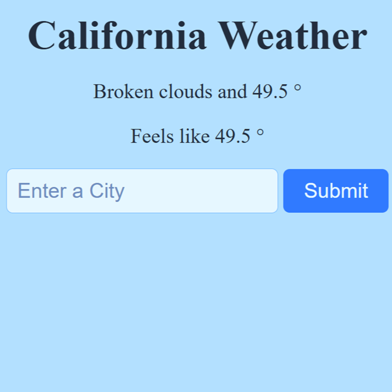

# Weather Prediction App
Get real time weather conditions for any city using the OpenWeatherMap API. This web app is built with Flask and served using Waitress. You can run it locally or deploy it on any standard server.

## Features
- Search for current weather conditions by city name.

- User-friendly web interface with clean styling.

- Handles invalid city names and provides a retry form.

- Uses OpenWeatherMap API for accurate weather data.

## Project Structure
```bash
├── weather.py
├── server.py
├── requirements.txt
├── templates/
│   ├── index.html
│   ├── city-not-found.html
│   └── weather.html
├── static/
│   └── styles/
│       └── style.css
```
## Prerequisites
- Python 3.7 or higher

- OpenWeatherMap API Key (free registration at https://openweathermap.org/api)

- All required packages are listed in `requirements.txt`.

## Installation
**1. Clone the repository**

```bash
git clone https://github.com/yourusername/weather-web-app.git
cd weather-web-app
```
**2. Install dependencies**
It’s recommended to create and activate a virtual environment:

```bash
python -m venv venv
source venv/bin/activate        # On macOS/Linux
venv\Scripts\activate           # On Windows

pip install -r requirements.txt
```
**3. Configure environment variables**

Create a `.env` file in the project root with your OpenWeatherMap API key:

```bash
API_KEY=your_openweathermap_api_key
```
## Usage
**Command Line**
You can get weather information from the terminal using `weather.py`:

```bash
python weather.py
```
- Enter a city name when prompted.

- If input is empty, defaults to "California".

**Web Interface**
Run the Flask server:

```bash
python server.py
```
Or directly with Waitress (if preferred):

```bash
waitress-serve --host=0.0.0.0 --port=8000 server:app
```
- Open your browser and go to http://localhost:8000

- Enter a city name and submit.

## Deployment

This weather app is deployed and live on Render. You can access the live version here: [Weather App Live Demo](https://weather-app-asmq.onrender.com).

<p align="center">
  
</p>

## File Descriptions
- `weather.py`: Contains the function to fetch weather data from the OpenWeatherMap API.

- `server.py`: Flask app with routes for index and weather search; uses Waitress for production-grade serving.

- `templates/index.html`: Main input form for city search.

- `templates/city-not-found.html`: Error page shown if city isn’t found.

- `static/styles/style.css`: Stylesheet for simple, readable UI.

- `requirements.txt`: Lists all Python dependencies.

## Environment Variables
- `API_KEY`: Required in your `.env` file for OpenWeatherMap access.

## Troubleshooting
- If you see "City Not Found," please check spelling or try another city.

- Ensure your `.env` file is present and contains a valid API key.

## License
This project is provided under the MIT License.

## Credits
- OpenWeatherMap API: https://openweathermap.org/api

- Flask: https://flask.palletsprojects.com/

- Waitress: https://docs.pylonsproject.org/projects/waitress/en/latest/
